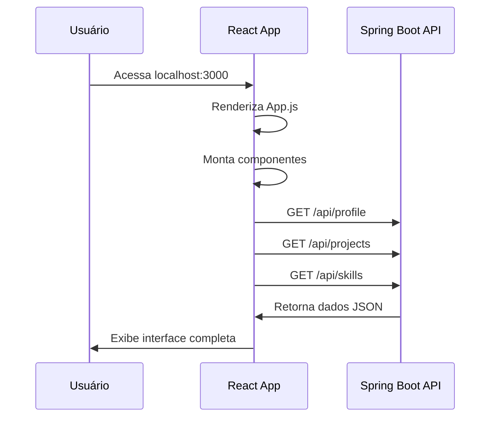

# 🏗️ Arquitetura do Projeto - Portfólio Gabriel Passos

## 📖 Visão Geral

Este documento detalha a arquitetura completa do projeto portfólio, explicando como cada parte funciona, se comunica e está organizada.

## 🎯 Padrão Arquitetural

### **Cliente-Servidor com API RESTful**
- **Frontend**: React SPA (Single Page Application)
- **Backend**: Spring Boot REST API
- **Comunicação**: HTTP/JSON via Fetch API
- **Estilo**: Arquitetura de Microserviços simples

```
┌─────────────────┐    HTTP/JSON    ┌─────────────────┐
│   React Client  │ ◄─────────────► │ Spring Boot API │
│   (Frontend)    │                 │   (Backend)     │
└─────────────────┘                 └─────────────────┘
```

## 🔧 Stack Tecnológico Detalhado

### **Backend (Spring Boot)**
```
📦 Backend Stack
├── 🍃 Spring Boot 3.0      # Framework principal
├── ☕ Java 17              # Linguagem de programação
├── 🐘 Gradle               # Build tool e gerenciamento de dependências
├── 🌐 Spring Web           # Para criação de APIs REST
├── 📡 CORS Support         # Comunicação cross-origin
└── 📊 ResponseEntity       # Padronização de respostas HTTP
```

### **Frontend (React)**
```
📦 Frontend Stack
├── ⚛️  React 18             # Biblioteca principal
├── 🎭 Framer Motion        # Animações e transições
├── 🎨 CSS3 + Variables     # Estilização avançada
├── 🔗 React Icons          # Ícones vetoriais
├── 📱 Responsive Design    # Layout adaptativo
└── 🚀 Modern JavaScript    # ES6+ features
```

## 🔄 Fluxo de Dados

### **1. Inicialização da Aplicação**


### **2. Fluxo de Navegação**
```
Usuário clica link → Navbar intercepta → ScrollIntoView → Seção ativa
```

### **3. Fluxo de Contato**
```
Usuário preenche → Validação client → POST /api/contact → Log server → Feedback user
```

## 📂 Estrutura de Componentes React

### **Hierarquia de Componentes**
```
App (Raiz)
├── Navbar (Navegação)
├── Hero (Apresentação)
├── About (Biografia)
├── Projects (Galeria)
├── Skills (Habilidades)
├── Contact (Formulário)
└── Footer (Rodapé)
```

### **Props e Estado**
```javascript
// Estado típico de componente
const [data, setData] = useState(null);        // Dados da API
const [loading, setLoading] = useState(true);  // Estado de carregamento
const [error, setError] = useState(null);      // Tratamento de erros
```

## 🎨 Sistema de Design

### **Variáveis CSS Globais**
```css
:root {
  /* 🎨 Paleta de Cores Neon */
  --primary-color: #af3dff;    /* Roxo Neon */
  --secondary-color: #ff3b94;  /* Rosa Neon */
  --accent-color: #55ffe1;     /* Ciano Neon */
  --success-color: #a6fd29;    /* Verde Neon */
  
  /* 🌑 Backgrounds Escuros */
  --bg-primary: #0a0a0f;       /* Preto Azulado */
  --bg-secondary: #151520;     /* Cinza Escuro */
  --bg-card: #1a1a2e;         /* Azul Escuro */
  
  /* 📝 Tipografia */
  --text-primary: #f0f0f0;     /* Branco Suave */
  --text-secondary: #b0b0b0;   /* Cinza Claro */
  
  /* ✨ Efeitos */
  --shadow-neon: 0 0 20px rgba(175, 61, 255, 0.5);
  --border-color: rgba(175, 61, 255, 0.3);
}
```

### **Metodologia CSS**
- **BEM-like**: Nomenclatura clara (.hero-name, .project-card)
- **Component-scoped**: CSS específico por componente
- **CSS Variables**: Consistência de cores e efeitos
- **Mobile-first**: Design responsivo progressivo

## 🔌 API Endpoints Detalhados

### **Estrutura de Resposta Padrão**
```typescript
interface ApiResponse<T> {
  data: T;
  status: number;
  headers: Headers;
}
```

### **1. GET /api/profile**
```javascript
// Resposta
{
  "name": "Gabriel Passos",
  "title": "Cientista da Computação", 
  "bio": "Cientista da Computação apaixonado...",
  "email": "gabriel.passos@unesp.br",
  "github": "https://github.com/gpassos01",
  "linkedin": "https://www.linkedin.com/in/gabriel-passos26/"
}

// Uso no Frontend
useEffect(() => {
  fetch('/api/profile')
    .then(res => res.json())
    .then(setProfile)
    .catch(handleError);
}, []);
```

### **2. GET /api/projects**
```javascript
// Resposta
[
  {
    "id": 1,
    "title": "Análise de Imagens...",
    "description": "Sistema de análise...",
    "technologies": ["Python", "OpenCV", "ESP32-CAM"],
    "githubUrl": "https://github.com/...",
    "imageUrl": "/images/...",
    "status": "completed"
  }
]

// Estados possíveis
"completed"    // ✅ Projeto finalizado
"coming-soon"  // 🚧 Em desenvolvimento
```

### **3. GET /api/skills**
```javascript
// Resposta
{
  "backend": [
    {"name": "Java", "level": 90},
    {"name": "Spring Boot", "level": 85}
  ],
  "frontend": [
    {"name": "React", "level": 85},
    {"name": "JavaScript/TypeScript", "level": 90}
  ],
  "tools": [
    {"name": "Git", "level": 90},
    {"name": "Docker", "level": 80}
  ]
}
```

### **4. POST /api/contact**
```javascript
// Request Body
{
  "name": "João Silva",
  "email": "joao@email.com", 
  "message": "Olá, gostaria de conversar..."
}

// Response
{
  "status": "success",
  "message": "Mensagem enviada com sucesso!"
}
```

## 🎭 Sistema de Animações

### **Framer Motion Patterns**
```javascript
// Animação de entrada padrão
const fadeInUp = {
  initial: { opacity: 0, y: 20 },
  animate: { opacity: 1, y: 0 },
  transition: { duration: 0.5 }
};

// Animação escalonada para listas
const staggerContainer = {
  animate: {
    transition: {
      staggerChildren: 0.1
    }
  }
};
```

### **CSS Animations**
```css
/* Animação de flutuação */
@keyframes float {
  0%, 100% { transform: translateY(0px); }
  50% { transform: translateY(-20px); }
}

/* Efeito shimmer */
@keyframes shimmer {
  0% { background-position: -200% 0; }
  100% { background-position: 200% 0; }
}
```

## 📱 Responsividade

### **Breakpoints**
```css
/* Mobile First Approach */
@media (max-width: 480px)  { /* Mobile */ }
@media (max-width: 768px)  { /* Tablet */ }
@media (max-width: 1024px) { /* Desktop Small */ }
@media (min-width: 1025px) { /* Desktop Large */ }
```

### **Estratégias Responsivas**
1. **Grid System**: CSS Grid com `auto-fit` e `minmax()`
2. **Fluid Typography**: `clamp()` para tamanhos adaptativos
3. **Flexible Images**: `object-fit` e `aspect-ratio`
4. **Touch Targets**: Botões com mínimo 44px
5. **Navigation**: Menu hambúrguer para mobile

## 🔧 Build e Deploy

### **Scripts de Desenvolvimento**
```bash
# Backend
./gradlew bootRun              # Inicia servidor Spring Boot
./gradlew build               # Build do projeto
./gradlew test                # Executa testes

# Frontend  
npm start                     # Servidor de desenvolvimento
npm run build                # Build de produção
npm test                      # Executa testes
```

### **Configuração de Proxy**
```javascript
// package.json
{
  "proxy": "http://localhost:8080"
}
```

## 🐛 Tratamento de Erros

### **Frontend Error Boundaries**
```javascript
// Tratamento padrão de erro
.catch(error => {
  console.error('Erro:', error);
  setError('Falha ao carregar dados');
  setLoading(false);
});
```

### **Backend Exception Handling**
```java
// Tratamento global de exceções
@ControllerAdvice
public class GlobalExceptionHandler {
  // TODO: Implementar para produção
}
```

## 🔒 Segurança

### **CORS Configuration**
```java
@CrossOrigin(origins = "*") // ⚠️ Apenas para desenvolvimento
// TODO: Configurar origens específicas para produção
```

### **Sanitização de Inputs**
```javascript
// TODO: Implementar validação robusta
// - XSS Protection
// - Input Sanitization  
// - Rate Limiting
```

## 📈 Performance

### **Otimizações Aplicadas**
1. **Lazy Loading**: Imagens carregam sob demanda
2. **Code Splitting**: Bundle otimizado
3. **Image Optimization**: Formatos eficientes
4. **Font Smoothing**: Renderização otimizada
5. **CSS Minification**: Estilos compactados

### **Métricas Alvo**
- **LCP**: < 2.5s (Largest Contentful Paint)
- **FID**: < 100ms (First Input Delay)  
- **CLS**: < 0.1 (Cumulative Layout Shift)

## 🚀 Próximos Passos

### **Melhorias Planejadas**
1. **Backend**:
   - Integração com banco de dados
   - Sistema de autenticação
   - Cache de respostas
   - Envio real de emails

2. **Frontend**:
   - PWA (Progressive Web App)
   - Modo escuro/claro
   - Internacionalização (i18n)
   - Testes automatizados

3. **DevOps**:
   - CI/CD Pipeline
   - Docker containers
   - Deploy automatizado
   - Monitoramento

---

## 👨‍💻 Desenvolvido por

**Gabriel Passos** - Cientista da Computação  
📧 gabriel.passos@unesp.br  
🐱 [@gpassos01](https://github.com/gpassos01) 